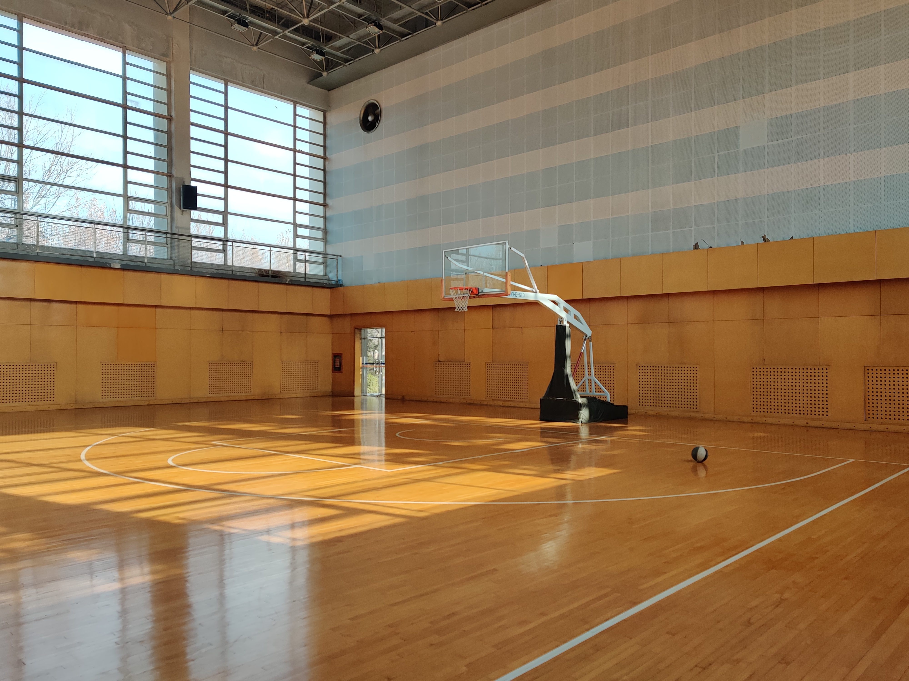

# 篮球小记

## 今日

中午如愿忙里偷闲去馆里练了会球，今天手感不错，很享受独自一人默默投篮的感觉，这让我能很快进入状态。快到一点钟的时候来了许多队长组局，邀请我去打了几拨，其中我和李磐队长对位，他身体条件很好，力量、速度都很足。但我没太敢放开手去攻，主要都给队长们传传球做助攻了，不过关键时候我能一锤定音，把该死的球放进篮筐，嘿嘿也算体验一把陪领导打球的感觉了。附一张图。

 

中午没睡去练球，下午果然有点困，果然午睡还是养成习惯了不好改啊。

晚上是120个俯卧撑，时刻让自己的身体保持活力状态吧，这样随时我都能让自己投入到更大强度的训练中去。

部署到github果然慢，加载个图片半天还没出来，呃不过既然是免费域名也不好说什么。

